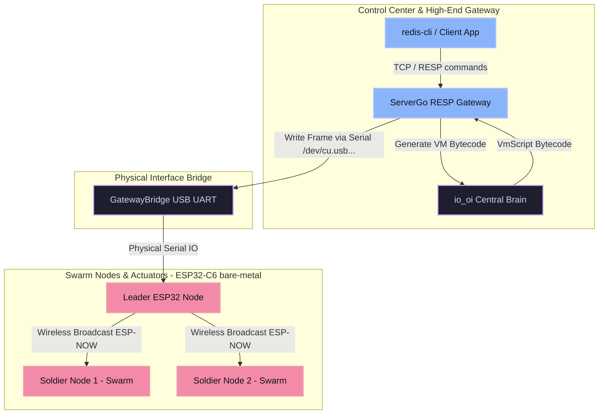

# ⚡️ tiny_io_oi

[](https://www.rust-lang.org)
[](https://github.com/hianova/tiny_io_oi)
[](./PolyForm-Noncommercial-1.0.0.txt)

An ultra-lightweight, zero-copy, reflexive control layer designed for massive edge swarm endpoints, industrial actuators, and bare-metal microcontrollers (e.g., ESP32-C6 RISC-V). 

`tiny_io_oi` implements a state-of-the-art **Asymmetric Edge Architecture**, acting as the **peripheral reflex arc** to the heavy distributed core `io_oi` (the central nervous system). It bypasses standard web protocol stacks, consensus mechanisms, and WASM runtime overhead to deliver microsecond-level reflexive control with zero dynamic allocation on bare metal.

---

## 📐 Asymmetric Edge Architecture

In industrial swarm control (e.g., 3D printer printheads, swarm robotics, bottle actuators), equipping every peripheral endpoint with full consensus protocols and a heavy runtime (like WASM/TCP/IP) increases edge latency and hardware costs exponentially. 

`tiny_io_oi` implements an asymmetric strategy:

*   **`io_oi` (Central Brain / Heavy P2P)**: Runs on servers or powerful gateway machines. It maintains full consensus, WASM execution environments, dynamic state trees, and P2P routing. It compiles high-level directives into ultra-compact `VmScript` bytecode.
*   **`tiny_io_oi` (Reflex Arc / Lightweight Node)**: Runs directly on ultra-low-cost microcontrollers. It maintains **zero heap allocation** (no `std` dependency), doesn't participate in P2P consensus, and doesn't run WASM. It simply executes high-speed, zero-copy `VmScript` bytecode streams received from the master, directly triggering physical hardware loops.



---

## ✨ Key Technical Pillars

### 🚀 1. `#[io_oi_node]` Macro & Compile-Time Routing
Using the custom attribute macro, the node structure is analyzed at compile-time to bind physical pins (PWM/GPIO) into hardware controllers. 
It replaces dynamic hash lookups or runtime vector routing with a highly optimized static `match` branch mapping inside the VM instruction loop.

```rust
#[io_oi_node]
pub struct SwarmActuator {
    #[bind(channel = 1, strategy = "PWM")]
    pub heater: PwmOutput,
    #[bind(channel = 2, strategy = "PWM")]
    pub extruder: PwmOutput,
    #[bind(channel = 3, strategy = "GPIO")]
    pub limit_switch: DigitalOutput,
}
```

### ⚡ 2. Zero-Copy VM Bytecode Execution
Dynamic commands are distributed via standard byte arrays (`VmScript`) and read via high-performance `rkyv` deserialization.
By enforcing zero-copy pointer offset operations, `tiny_io_oi` executes complex nested loop instruction streams and physical assertions with absolute minimal CPU clock cycles.

### 🛡️ 3. Safe Traps & Fail-Safe Hardware Shutdown
In industrial environments, hardware failures or communication errors can be catastrophic. The MicroVM is equipped with strict watchdog safety layers:
*   **Fuel Exhaustion Trap (`OutOfFuel`)**: Automatically aborts runaway loops.
*   **Physical Assertion Failures (`AssertOrYield`)**: Triggers real-time interrupt checks.
*   **Safe Shutdown Hook**: Instantly pulls all registered PWM/GPIO channels to `0` upon any trap or exception, broadcasting an `OpCode::Exception` packet back to the gateway.

### 💾 4. Lock-Free Static Arena & `TinyArc` (No-Heap)
To prevent heap fragmentation and memory leaks on bare-metal systems, `tiny_io_oi` includes an embedded-optimized `TinyArc` reference-counting model backed by a global thread-safe **Lock-Free Static Arena**. This delivers absolute memory safety and zero memory leaks under extreme multi-threaded bare-metal workloads.

### 📡 5. Active Subjective Failover & Leader Demotion
*   **Heartbeat Decay**: Soldier nodes track subjective leader heartbeat status. If the master/leader drops offline, nodes decay their trust scores and autonomously enter **Safe Mode** (disabling actuators).
*   **Double-Sign Protection**: If a compromised leader sends conflicting instructions within the same Epoch, nodes detect the cryptographic double-sign violation, write the conflict to the Local Jury Log, disqualify the leader, and trigger safe-state demotion.

---

## 📁 Repository Structure

```
tiny_io_oi/
├── Cargo.toml                  # Workspace dependencies & features (std / tiny-node)
├── ReadMe.md                   # You are here
├── SPEC.md                     # Lean specification for the io_oi consensus model
├── TODO.md                     # Active tracking of the development progress
├── PERF.md                     # Performance benchmarks and version updates
├── tiny_io_oi_macros/          # Proc-macro implementation for #[io_oi_node]
├── esp32_firmware/             # ESP32-C6 bare-metal firmware implementing the Soldier & Gateway roles
└── src/
    ├── lib.rs                  # Module declarations and primary exports
    ├── drivers.rs              # Physical driver abstraction layer & mock implementations
    ├── hardware.rs             # Hardware state router, PWM and GPIO mapping
    ├── memory.rs               # Lock-free Static Arena & reference-counted TinyArc
    ├── vm.rs                   # Zero-copy bytecode executor micro-virtual-machine
    ├── node.rs                 # Active failover state-machine & swarm node control
    └── gateway.rs              # USB Serial framing and GatewayBridge pipeline
```

---

## 🔧 Building & Testing

Verify that all unit and integration tests (including the lock-free multi-threaded drop and failover state machines) compile and execute cleanly:

```bash
# Check dependencies and settings inside Cargo.toml
# Then run the entire test suite
cargo test --workspace
```

---

## ⚡ E2E Physical Verification Loop

`tiny_io_oi` includes an end-to-end integration architecture using a standard Redis protocol bridge (`ServerGo`) and USB-connected ESP32 microcontrollers:

```
[redis-cli] ──(RESP protocol)──> [ServerGo TCP Server] ──(Serial over USB)──> [ESP32 Gateway Node] ──(ESP-NOW Wireless)──> [ESP32 Soldier Nodes]
```

### 1. Start the RESP Gateway
Ensure you have the [ServerGo RESP Gateway](https://github.com/hianova/ServerGo) running on macOS/Linux connected to the gateway's serial port:

```bash
# Start the RESP gateway bridge over USB Serial port
./servergo --port /dev/cu.usbmodem5ABA0089811
```

### 2. Verify Connection
Query the RESP Gateway using a standard Redis CLI tool:

```bash
redis-cli -p 6379 PING
# Expected response: PONG
```

### 3. Dynamic VM Script Injection & Actuator Control
Compile a dynamic `VmScript` (e.g., instructing a 3-cycle heater LED flash) and inject it instantly into the entire swarm via the broadcast channel:

```bash
# Compile and inject the raw bytecode via redis-cli
redis-cli -p 6379 -x PUT vm:broadcast < target/debug/examples/blink_script.bin
```

The gateway receives the instruction, wraps it inside an aligned `GatewayFrame`, pushes it through UART, and the ESP32 Gateway broadcasts it instantly to edge Soldier nodes over ESP-NOW, causing physical LED flashes.

---

## 🛠️ Cross-Compiling & Flashing Firmwares

To compile the bare-metal firmware for the **ESP32-C6** (RISC-V `riscv32imac-unknown-none-elf` target):

### Prerequisite Setup
Install the target and tools:
```bash
rustup target add riscv32imac-unknown-none-elf
cargo install espflash cargo-espflash
```

### Build the Firmware
```bash
cd esp32_firmware
cargo build --release --target riscv32imac-unknown-none-elf
```

### Flash target ESP32 Device
Connect your ESP32-C6 via USB and flash the compiled binary directly:
```bash
espflash flash target/riscv32imac-unknown-none-elf/release/esp32_firmware --monitor
```

---

## ⚡ Bun FFI JavaScript/TypeScript Integrations

`tiny_io_oi` includes production-grade FFI bindings designed specifically for **Bun's ultra-low-latency Native FFI**. This allows host-side coordinators to control swarms dynamically and perform zero-copy DSP operations directly from JS/TS:
*   **Bilingual Developer Guide**: Check out the comprehensive [Bun FFI README Guide](./bun/README.md) for full setup instructions in both English and 繁體中文.
*   **LED Blink Example**: See the [Blink Swarm LED example script](./bun/README.md#example-1-blinking-swarm-led-bytecode-compilation--broadcast) to learn how to dynamically compile VmScript binary commands on-the-fly.
*   **FFT Vibration Damping**: See the [FFT DSP example script](./bun/README.md#example-2-real-time-active-vibration-damping-via-high-speed-fft) to analyze sensory raw buffers with zero GC overhead.

---

## 📄 License
Licensed under the [PolyForm-Noncommercial-1.0.0](PolyForm-Noncommercial-1.0.0.txt). For commercial usage or custom swarms, please contact the development team.

